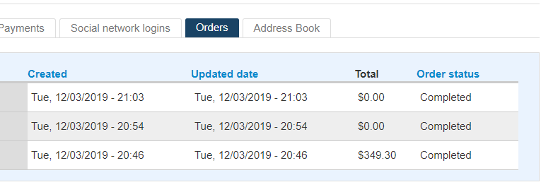
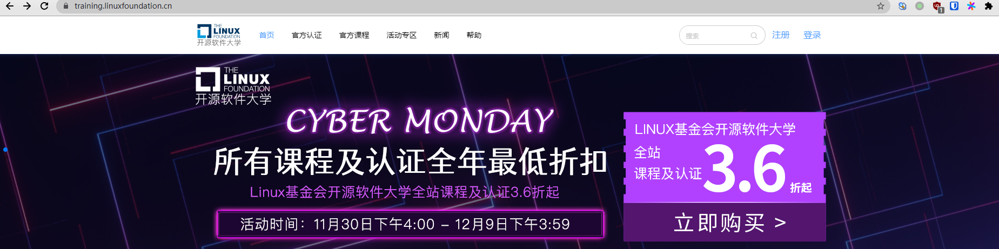
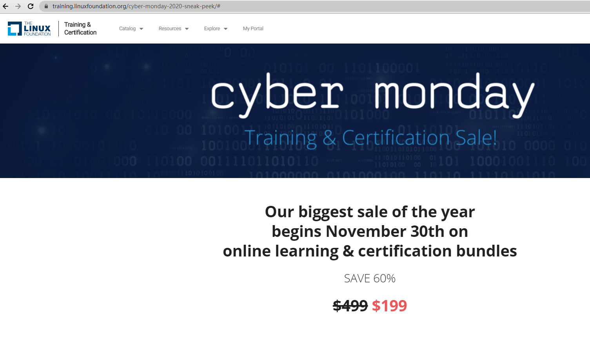
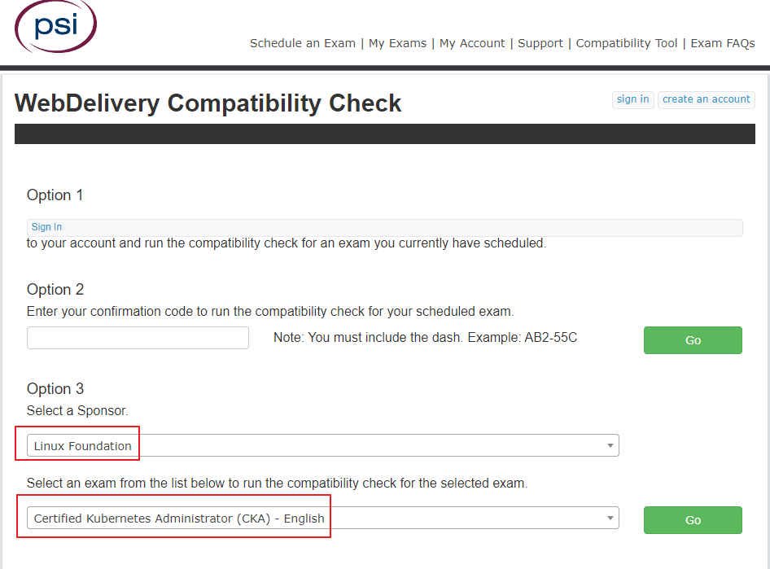
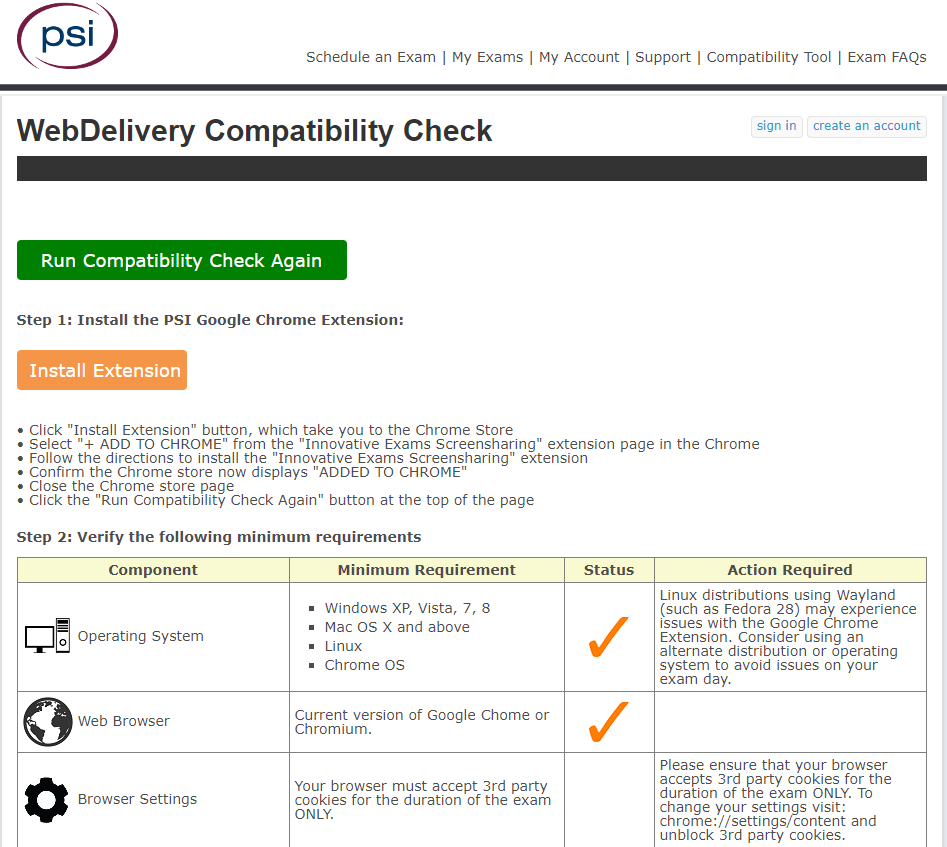

# 1. CKA、CKAD考试经验

**CKA:** Kubernetes管理员认证（CKA）旨在确保认证持有者具备履行Kubernetes管理员职责的技能，知识和能力。 CKA认证可帮助经过认证的管理员在就业市场中快速建立自己的信誉和价值，并能帮助公司更快地雇用高质量的团队来支持他们的发展  

如果企业想要申请[KCSP](https://www.cncf.io/certification/kcsp/)条件之一是：至少需要三名员工拥有CKA认证  

**CKAD:** Kubernetes应用程序开发人员认证（CKAD）旨在确保CKAD具备履行Kubernetes应用程序开发人员职责的技能，知识和能力。 经过认证的Kubernetes Application Developer可以定义应用程序资源并使用核心原语来构建，监视和排除Kubernetes中可伸缩应用程序和工具的故障  

这里主要和大家分享一下考试报名优惠、如何备考和考试注意事项  

# 2. 考试报名

## 2.1 报名地址
- 英文监考官
  - [CKA](https://www.cncf.io/certification/cka/)

  - [CKAD](https://www.cncf.io/certification/ckad/)

- 中文监考官
  - [CKA-CN](https://training.linuxfoundation.cn/certificate/details/1)

  - [CKAD-CN](https://training.linuxfoundation.cn/certificate/details/4)
  
英文监考和中文监考最大区别：
- 中文监考考试可以使用支付宝支付，不需要美元信用卡
- 中文监考的考官会中文

报名成功之后，可在12个月之内进行考试，考试不过有一次补考机会。

## 2.2 考试者身份认证证件

- 护照 / 港澳通行证

  如果使用护照 / 港澳通行证作为身份验证，考试者姓名需要填写名字拼音（与证件一致）

- 居民身份证

  如果没有护照、港澳通行证之类的带名字拼音的证件，使用身份证考试也可以（有小伙伴在中文监考`CKA-CN`验证过使用身份证考试， 英文监考没试过），若使用身份证来验证身份，选择考场时填写考试者姓名需要填写**中文姓名**（与证件一致）


## 2.3 获取证书条件

~~CKA：74分或以上可以获得证书~~ (最新规定已经改成66分)

CKA：66分或以上可以获得证书, 详见[官方说明](https://docs.linuxfoundation.org/tc-docs/certification/faq-cka-ckad-cks#what-score-is-needed-to-pass-the-exam)

CKAD：66分或以上可以获得证书  


## 2.4 国内现场考点

~~如果你没有合适的考试环境，可以考虑到现场考点去考试，我没去过现场考点，具体请咨询说明里面的考点电话~~

[~~国内考点说明~~](https://training.linuxfoundation.cn/faq#13)

目前[2021-03-18]查看 https://training.linuxfoundation.cn/ 已经找不到线下考试说明（估计是由于新冠疫情的原因）  


## 2.5 报名优惠

每年 Cyber Monday 的优惠力度是最大的，大概打5折左右（Cyber Monday：网络星期一，也就是黑五后的第一个星期一，这一天通常在11月底12月初这样），买课程送考试报名资格。我当时在网络星期一买了 CKA+CKAD 的课程（送考试资格）共花费349美金，算起来打5折左右这样子  

*平时没有必要单独购买这个课程，有活动送考试资格时可以买，即相当于为了买考试资格而不是买课程*   
 
购买优惠活动中课程后会将考试报名优惠码（优惠100%，就是不用再付费了，抵消300美元的考试报名费。*现在报名费已经涨到375美元了*）发到邮箱，报名优惠码有效期为一个月，使用优惠码报名之后12个月内进行考试   

如下图，最下面那个349美金的订单是购买CKA+CKAD的课程套餐，图中上面两个0元订单（CKA和CKAD考试报名订单）是用购买课程送的优惠码买的   



**往年 Cyber Monday 活动截图：**




# 3. 备考  

考试时你可以打开两个浏览器Tab，一个是考试窗口，一个用来查阅官方文档（仅允许访问https://kubernetes.io/docs/、https://github.com/kubernetes/ 和https://kubernetes.io/blog/ ）  

*注意：在官方文档搜索时，结果有可能并不是在 https://kubernetes.io/docs/ 和 https://kubernetes.io/blog/ 子域下，不能在考试中点开*  

考试内容相对简单，其实就是考`kubectl`用法，考`yaml`  
考试主要是考察对各种 K8s 资源的了解，会使用各种资源，平时练习多注重 kubectl 使用技巧，多熟悉官方文档（考试时可查官方文档直接复制一些复杂的 yaml 来修改使用）  
  
考题例子：
- 创建一个 nginx pod （对，部分题目就是这么简单）
- 创建一个 configmap 并挂载到指定 pod 上
- 创建多容器 pod （题目指定包含哪些镜像，例如 nginx、redis 等）
- 创建一个 pv
- 创建一个 pvc 并绑定
- 排查一下 node 节点为啥NotReady了，去到 node 一看，kubelet没启动，启动完事
- 使用 kubeadm 创建一个集群  

*就上面这几题就能拿三四十分了*

这个考试真的是比较简单那种，只要认真练习`CKA练习`，拿66分以上没啥难度  

CKA练习: 
- https://github.com/stretchcloud/cka-lab-practice （这个已经蛮久没更新了，虽然考岗有一些变动，但是练习还是适用的）
- https://github.com/David-VTUK/CKA-StudyGuide

CKAD练习: 
- https://github.com/dgkanatsios/CKAD-exercises)

在练习时需要注意，不能直接看练习里面的答案，必须从官方文档查找答案，加深对官方文档的熟悉程度，可以将练习中使用到的官方文档保存到浏览器收藏夹，方便考生时直接点开来复制 yaml

除了上面的练习题，还需要熟悉了使用[kubeadm](https://kubernetes.io/docs/setup/production-environment/tools/kubeadm/create-cluster-kubeadm/)创建集群、升级集群


在线练习环境：

- [katacoda](https://www.katacoda.com/courses/kubernetes/kubectl-run-containers)
- [play-with-k8s](https://labs.play-with-k8s.com/)

建议大家任一在线K8s环境里练习一次，主要是熟悉一下web终端  


# 4. 考前检查及考试环境

- **考试形式:** 在线监考，需要共享桌面和摄像头  

- **考试环境:** 在一个密闭空间，例如书房、卧室、会议室等，电脑屏幕不能对着窗户，房间里除了考生不能存在第二个人，考试的桌面不能放其它东西，水杯也不行  

- **考试时间:** CKA、CKAD均为两小时

- **选择考试时间:** 报名成功之后可以在12个月之内进行考试，考试之前需要选择考试时间，选择考试时间的时候记得先选择北京时区，默认是0时区时间。

- **电脑要求:** 可以在这里[WebDelivery Compatibility Check](https://www.examslocal.com/ScheduleExam/Home/CompatibilityCheck)检测自己的电脑环境和网络速度等

  

  检查测试前先点击“Install Extension”，安装chrome插件，这个插件是考试时用来共享屏幕和摄像头的，安装过程需要爬墙，考试过程不需要爬墙  

  

- **考试前考官检查:** 

  - 考试可以提前15分钟进入考试界面
  - 考官会在网页中的聊天窗口发送消息的和你交流（没有语音交流，只有文字交流）
  - 看不懂考官发的英文怎么办：可以在chrome浏览器右键翻译
  - 考官会让你共享摄像头，共享桌面
  - 考官会让你出示能确认你身份ID的证件，我当时用的是罗技C310摄像头（建议大选用可用对焦的摄像头），无法对焦，护照看上去模糊到不行，后来考官叫我给护照打光还是不行。最后考官叫我打开手机，用手机相机当作放大镜用，这样才能看清楚。（我考CKAD的时候，我护照还没举稳，考官就说可以了，应该是考过CKA，他们系统里面已经有我的信息了，就随便瞄了一眼而已）
  - 考官会让你用摄像头环视房间一周，确认你的考试环境（当时我房间门开了一个小缝也要求我去把门关好，还是比较严格的）
  - 考官会让你用摄像头看你的整个桌面和桌子底下
  - 考官会让你再次点一下桌面共享，然后你叫你点击取消，然后就开始进入考试了

- **考试的界面:** 

  - 左边是题目
  - 右边是终端
  - 终端上面是共享摄像头、共享屏幕、考试信息等按钮（可以唤出记事本）

- **考试过程:** 

  - 考试计时：按照你实际开始时间开始计时（进入有题目的考试界面开始计算）。比如你约的是下午两点开始考试，但是考官检查花了比较长的时间，到两点半才说可以进入考试，那么你的考试是从两点半开始算起  
  - 考试题目有好几种语言的翻译（包含了中文翻译），题目里的关键词都是标红的，比如pod name等等，建议看英文版的题目，中文翻译感觉是机翻的，读着有点别扭
  - 考试结束前15分钟考官会发消息提示你考试还剩下15分钟，不过这个看考官心情把，我考CKA的时候没提示了，考CKAD的时候提示了  
  - 考试时间到，考官会发消息提醒你，叫你退出考试  
  
  

# 5. 考试心得

- **考试难度**

  总的来说CKA考试还是相对简单的，如果你有K8s生产环境维护使用经验，大可以直接考试，过线是没问题的；CKAD难度也不大，题量较CKA大，需要注意每道题的时间分配

- **kubectl自动补全**

  注意使用kubectl自动补全，考试环境默认已经配置了kubectl自动补全，无需考生另行配置，但是这还不够，我们可以用`k`代替`kubectl`  [kubectl Cheat Sheet](https://kubernetes.io/docs/reference/kubectl/cheatsheet/)

  ```
  alias k=kubectl
  complete -F __start_kubectl k
  ```

- **使用考试环境提供的记事本**

  使用记事本，考试过程中，最好将使用过的命令记录到记事本，后面的题目可以稍微改动再使用（特别是创建pod的命令，估计要使用七八次吧）

- **使用--dry-run生成yaml**

  使用--dry-run参数来生成一个基础的yaml，再按照题目要求修改这个基础yaml文件，不要纯手写yaml。如果题目无特殊要求，能kubectl命令完成的就不要使用yaml文件，这个比较浪费时间。

- **浏览器收藏夹**

  将上面备考中的github仓库练习题中提到的官方文档保存到浏览器收藏夹，这样做的目的是在浏览器地址栏输入关键词，就会弹出收藏好的官方文档地址，就可以直达对应的文档，不需要在官方文档上再一次搜索

- **vim编辑器**

  vim编辑器要求不高，但是你至少要知道如何进入编辑模式，如何保存文档，复制粘贴之类的快捷键记不记都行，可以右键复制粘贴

- **web终端中的复制粘贴**

  web终端中无法使用Ctrl+C、Ctrl+V（考试提供的记事本可以使用），使用Ctrl + Insert，Shift + Insert代替，web终端中也可以使用右键复制粘贴
